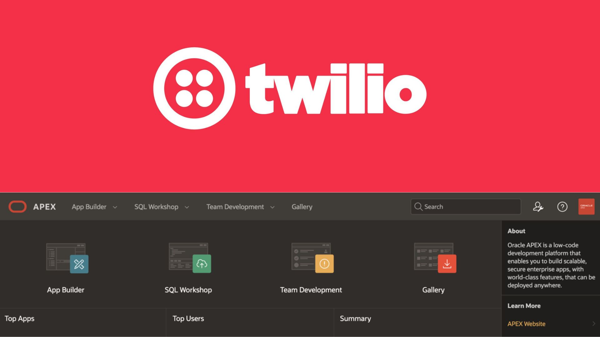
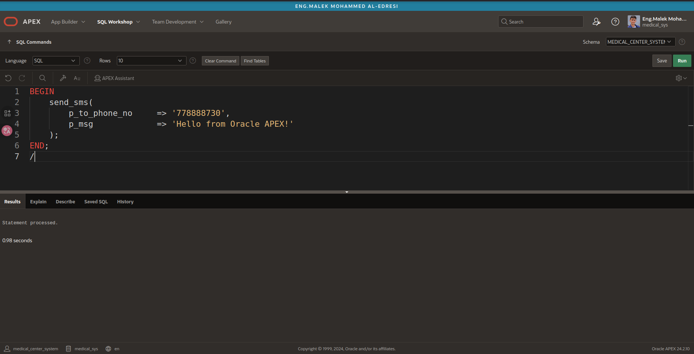
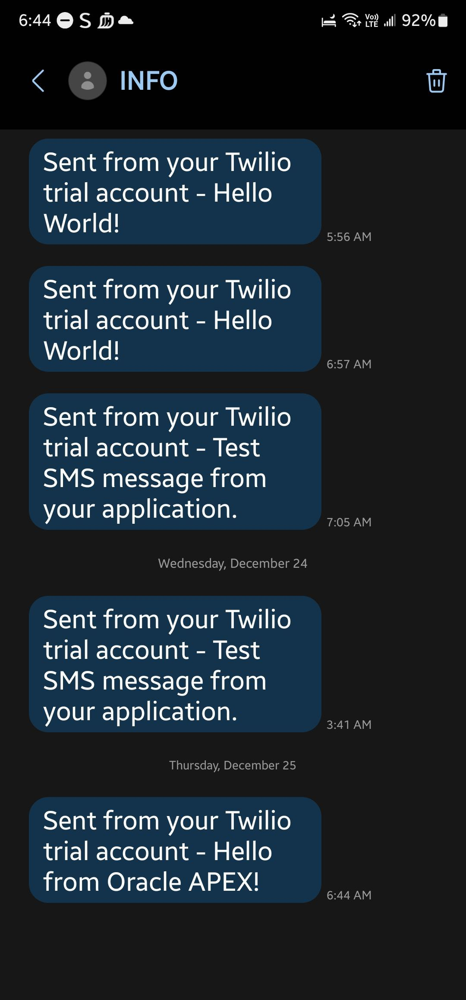

# Oracle APEX + Twilio SMS Integration

This project demonstrates how to integrate **Twilio SMS API** with **Oracle APEX / Oracle Database (PL/SQL)** to send SMS messages programmatically.
It includes example SQL scripts, a stored procedure for sending SMS, configuration steps, and sample usage.

---
 

| Procedure Code | Run Preview |
|----------------|-------------|
|  |  |

---

## Features

* Send SMS directly from Oracle Database using Twilio API
* Ready-to-use `PL/SQL` procedure for message sending
* Works with **Oracle APEX** and **Autonomous Database**
* Simple configuration & customizable message body
* Example SQL script included

---

## Project Structure

```
oracle-apex-twilio-sms-integration/
├── README.md                     # Documentation
├── script.sql                    # Twilio SMS procedure + test example
└── screenshot/
    └── procedure.png             # Screenshot of PL/SQL procedure
    └── message.jpg               # Screenshot of message output
```

---

## Requirements

| Component          | Version                             |
| ------------------ | ----------------------------------- |
| Oracle Database    | 12c or higher (19c recommended)     |
| Oracle APEX        | Optional (for UI integration)       |
| Twilio Account     | With API Credentials                |
| Network ACL/Wallet | Required for HTTPS outbound request |

---

## Setup Instructions

### 1. Get Twilio Credentials

From Twilio Console:

```
ACCOUNT_SID
AUTH_TOKEN
TWILIO_PHONE_NUMBER
```

---

### 2. Create Procedure Inside Oracle

Import `script.sql` or create manually.

Example structure:

```sql
create or replace procedure send_sms_twilio(
    p_to_phone_no in varchar2,
    p_message     in varchar2
) is
    ...
end;
/
```

---

### 3. Test SMS Sending

```sql
BEGIN
    send_sms_twilio(
        p_to_phone_no => '+1234567890',
        p_message     => 'Hello from Oracle APEX & Twilio!'
    );
END;
/
```

---

## APEX Integration Example

You may call the procedure after button click or dynamic action:

```plsql
send_sms_twilio(:P0_PHONE, :P0_MESSAGE);
```

---

## Security Notes

* Do not publish **AUTH_TOKEN** publicly
* Use **APEX Credential Store / Vault** for production
* Ensure network access to `api.twilio.com`

---

## About Me

**Malek Mohammed**  
*Oracle APEX Engineer, PL/SQL Specialist, Database & Cloud Developer*

